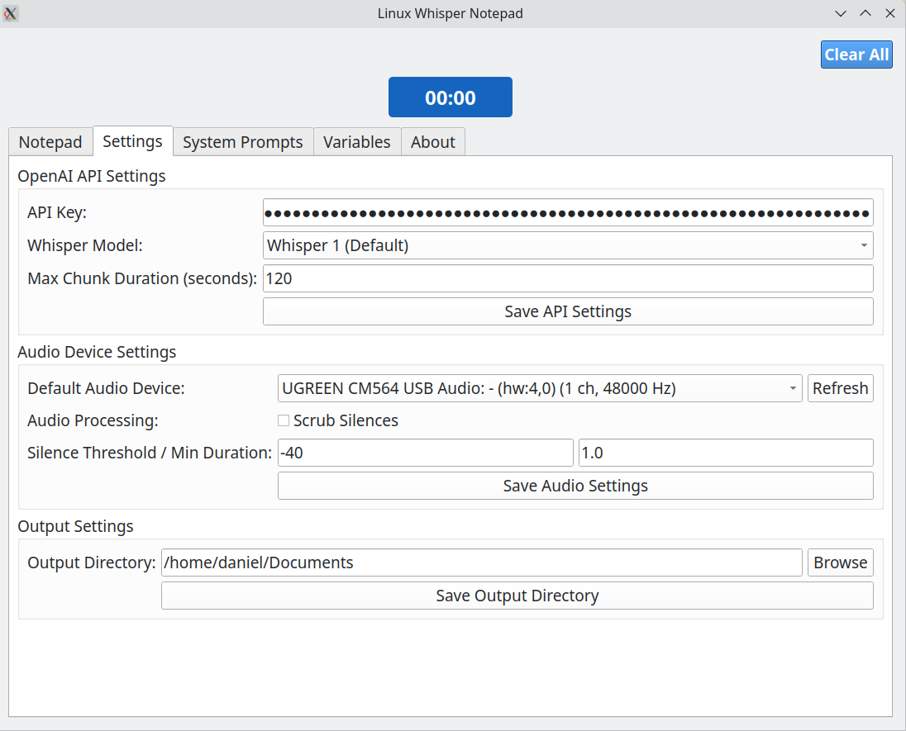
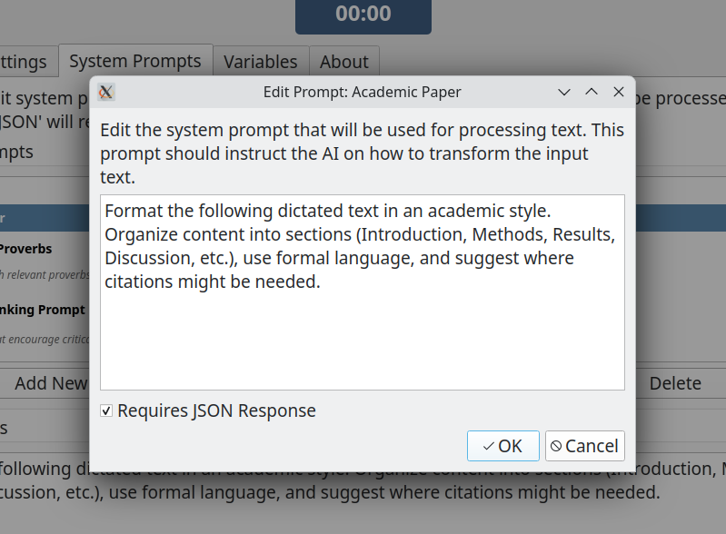

# Linux Whisper Notepad
 
 

A notepad and text conversion application for Linux with speech-to-text processing and text refinement capabilities using OpenAI APIs.

## Background

Linux Whisper Notepad is an improved version of a previous Linux Notepad application, created with the assistance of AI cogeneration. The primary motivation behind developing these applications was my profound appreciation for OpenAI's Whisper technology.

When searching for Linux applications that utilized Whisper, I discovered that most available tools only supported locally hosted Whisper models. As someone who prefers using Whisper via the cloud due to its reasonable API costs, reliable performance, and faster processing times, I created this application to fill that gap.

This app follows a multi-stage process:
1. Recording audio through the user interface
2. Sending the recorded audio for transcription via OpenAI's Whisper API
3. Processing the transcribed text through a customizable pipeline using GPT with system prompts to refine the output

The text processing strategy can be tweaked and adapted as desired. I encourage anyone interested in the concept to fork or contribute to the codebase and develop more useful system prompts for reformatting text.

The primary use cases for this application include:
- Capturing meeting notes or lecture content
- Creating to-do lists through voice dictation
- Any scenario where voice input provides a faster interface for capturing text than typing

# V2 Updates

- Editable system prompts  
- Condensed layout with UI optimisations  


## Screenshots

Use the settings page in order to update your Open API key and set your preferred microphone source. 



A progress bar displays as your captured. Recorded audio is sent to the Open AI API for transcription using Whisper.


## Text Conversion Presets

The utility is loaded with default system prompts in order to facilitate converting the basic recorded transcript to different formats. The original transcript is editable to allow the user to fix basic mistakes that were  Introduced during the initial transcription via Whisper and which would be otherwise passed on to the next stage. 



## Transcribed And Optimised Text

Once the process text is received backed from Open AI, it is presented in the converted text area:


## Download As Markdown

Markdown is my preferred file format for working with all things documents, especially related to AI workflows. 

The utility uses Open AI to automatically generate a suggested title for the note, and then provides a convenient download feature which will save the optimized node to the user's preferred default path, which can be set in the Settings menu. 


## Features

- Audio recording from selected input devices
- Speech-to-text transcription using OpenAI Whisper
- Text processing with various modes using OpenAI GPT-3.5 Turbo:
  - Basic text cleanup
  - Extract to-do items
  - Shakespearean English conversion
  - Meeting minutes formatting
  - Bullet point summary
  - Technical documentation formatting
- Custom system prompts creation and management
- One-click transcription and processing
- Copy to clipboard functionality for both transcribed and processed text
- Save processed text as markdown files
- Persistent configuration storage

## Requirements

- Python 3.8 or higher
- PyQt6 for the GUI
- PyAudio for audio recording
- OpenAI API key

## Installation

1. Clone this repository:
   ```bash
   git clone https://github.com/yourusername/Linux-Whisper-Notepad-0325.git
   cd Linux-Whisper-Notepad-0325
   ```

2. Create a virtual environment (recommended):
   ```bash
   python -m venv .venv
   source .venv/bin/activate
   ```

3. Install dependencies:
   ```bash
   pip install -r requirements.txt
   ```

3. Run the application:
   ```
   python linux_whisper_notepad.py
   ```
   
   Or use the provided script:
   ```bash
   ./run.sh
   ```

## Usage

1. **Audio Recording**:
   - Select your audio input device
   - Use the recording controls to start, pause, and stop recording
   - The recording time is displayed

2. **Transcription**:
   - After recording, click "Transcribe Audio" to convert speech to text
   - Alternatively, use "Transcribe and Process" to perform both steps at once
   - Requires an OpenAI API key (set in Settings tab)
   - Use the "Copy to Clipboard" button to copy the transcribed text

3. **Text Processing**:
   - Select a processing mode from the dropdown
   - Click "Process Text" to refine the transcribed text
   - The processed text will appear in the text area below
   - Use the "Copy to Clipboard" button to copy the processed text

4. **Saving**:
   - A suggested filename will be generated based on the content
   - You can edit the filename if desired
   - Click "Save Text" to save the processed text as a markdown file
   - Files are saved to the configured output directory

5. **Custom System Prompts**:
   - Navigate to Settings > System Prompts
   - Create, edit, or delete custom processing prompts
   - Custom prompts appear in the processing mode dropdown in alphabetical order
   - Default prompts can be edited but not deleted
   - Reset to defaults option is available if needed

## Configuration

All settings are stored in `~/.config/linux-whisper-notepad/settings.json` and include:
- OpenAI API key
- Default audio device
- Output directory for saved files
- Last used processing mode

Custom system prompts are stored in `~/.config/linux-whisper-notepad/custom_prompts.json`.

## Troubleshooting

- If you encounter audio device issues, try selecting a different audio input device from the dropdown.
- Make sure your OpenAI API key is valid and has sufficient credits for using the Whisper and GPT-3.5 Turbo models.

## License

MIT